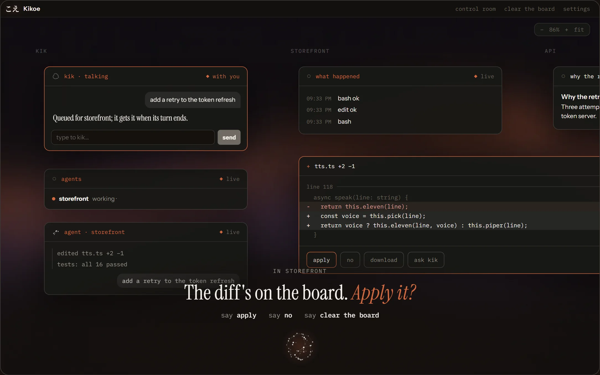
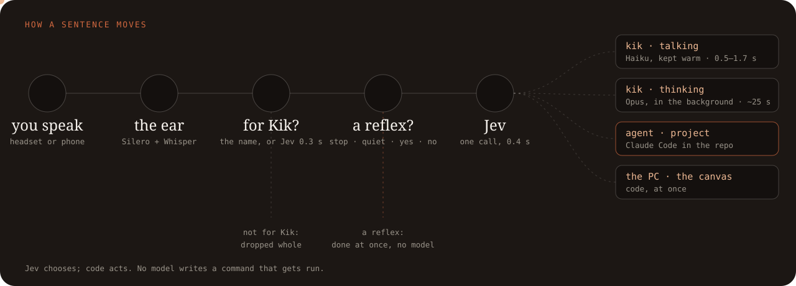
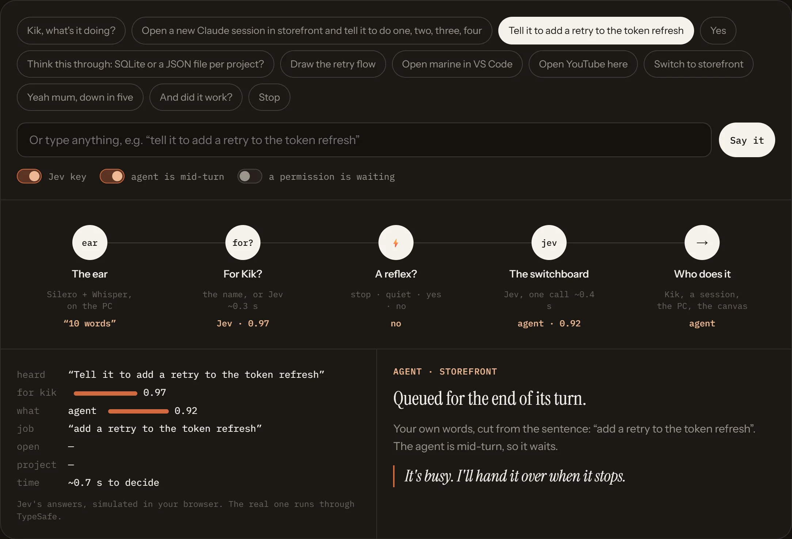
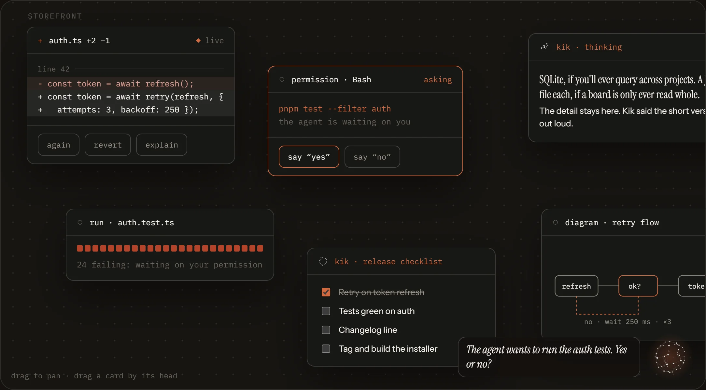
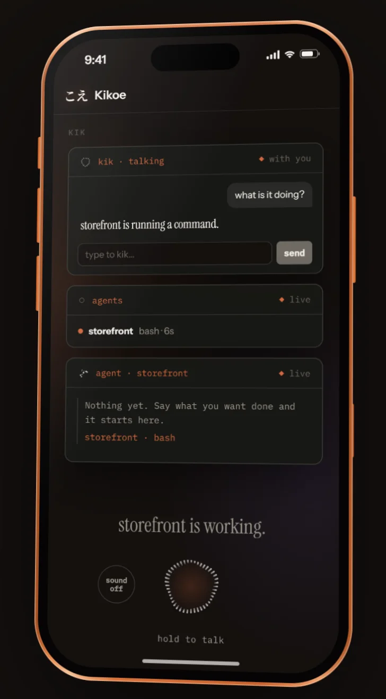
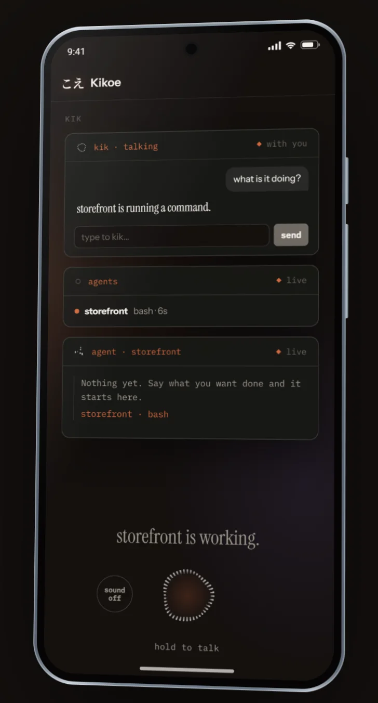
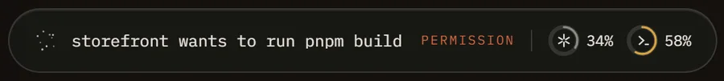

<p align="center">
  
</p>

<p align="center">
  
</p>

<p align="center">
  <a href="#quick-start"><b>Quick start</b></a> ·
  <a href="#how-it-works">How it works</a> ·
  <a href="#what-you-can-say">What you can say</a> ·
  <a href="#the-website">The website</a> ·
  <a href="LICENSE">MIT</a>
</p>

Kikoe is a desktop app for Windows (macOS and Linux build in CI) that sits
beside [Claude Code](https://claude.com/claude-code). It has an ear, a voice, a
mind and an infinite canvas. You talk; Kik listens, answers in one good line,
and hands the job to the right agent. Everything runs through your own Claude
subscription via Claude Code: no terminal wrapper and no PTY. Claude Code's
hooks go in, and speech and cards come out.

The logo is **こえ** (*koe*, "voice"). The name is **Kikoe** (聞こえ, "audibility").

<p align="center">
  
</p>

---

<sub>01 · HEARING</sub>

## It hears the room. It keeps *only what was for Kik.*

A headset mic, Silero to find speech and Whisper to write it down, all on your
PC. Say "kik" and the sentence is for Kik. Leave the name out and
[Jev](https://docs.typesafe.ai) judges whether you meant it for Kik, in about
0.3 seconds: "yeah mum, down in five" scores 0.04, "and did it work?" 0.82.
What wasn't for Kik is dropped whole. It isn't logged, listed or streamed, and
only a word count survives.

<sub>02 · DECIDING</sub>

## One sentence, *one decision,* and code does it.

<p align="center">
  
</p>

Jev is the switchboard. It never writes text. It chooses from fixed options and
says how sure it is. One call, about 0.4 seconds, answers four questions: what
should happen (Kik, think, the agent, a new session, open, canvas, stop), which
part of the sentence is the job (always a cut of your own words, never a
paraphrase), what to open, and which project. Then plain code acts. When Jev is
under 0.6 sure, or there's no key or network, the regex rulebook decides, as it
did before Jev.

<p align="center">
  
</p>

<sub>03 · THREE SESSIONS</sub>

## Kik talks fast, thinks slowly, and *leaves the work to the agent.*

All three run through Claude Code on your subscription, with no API key:

| Card | What it is | Model | Speed |
|---|---|---|---|
| **kik · talking** | Kik's side of the conversation | Haiku, thinking off, one process kept open | first word in 0.5 to 1.7 s |
| **kik · thinking** | questions that need real thought | Opus, extended thinking | ~25 s, while you keep talking |
| **agent · ‹project›** | the coding agent doing the work | Claude Code in the project folder | as long as the work takes |

<sub>04 · SHOWING</sub>

## Every diff, test run and reply lands as *a card you can act on.*

One board per project. Claude Code's hooks bring back what the agent did: it's
narrated, permissions are held open until you answer, and every edit, command
and reply becomes a card with buttons ("again", "revert", "explain") that turn
into instructions to the agent. Kikoe itself never writes to your repo.

<p align="center">
  
</p>

The full walk-through, with every number measured, is
[docs/PIPELINE.md](docs/PIPELINE.md).

<sub>05 · IN YOUR POCKET</sub>

## One canvas, *at the desk and on your phone.*

<table>
<tr>
<td width="50%" align="center"></td>
<td width="50%" align="center"></td>
</tr>
</table>

The same canvas, streamed to your phone. Hold the orb and talk, and the work
happens on the PC as usual. Turn on sound and you hear Kik on the phone as well
as at the desk.

- Switch on **Settings → Phone**, open the link on your phone and trust the
  certificate once. The phone gets its own token: it can watch the canvas and
  talk or type to Kik, but it can't approve a tool call or press a card's
  buttons.
- **Away from home**: with Tailscale, Kikoe serves the phone on your tailnet
  with a real certificate, reachable only from your own devices.

And on the desk, the **island**: a pill at the top of the screen with Kik's
state and a ring for how much of each assistant's limit is used.

<p align="center">
  
</p>

## What you can say

| You say | What happens |
|---|---|
| "Kik, what's it doing?" | Answered from the live picture, in a sentence |
| "Open a new Claude session in storefront and tell it to do one, two, three, four" | A fresh Claude Code session starts in `storefront` with exactly that job |
| "Tell it to add a retry to the token refresh" | Straight to the agent if it's idle, queued for the end of its turn if not |
| "Yes" / "no" (while a permission is waiting) | The agent's permission prompt is answered; nothing else touches it |
| "Think this through: SQLite or a JSON file per project?" | Handed to a thinking session. Kik answers in a few sentences and puts the detail on the canvas |
| "Make me a release checklist" / "draw the retry flow" | A card on the canvas |
| "Open marine in VS Code" / "open github.com" / "a terminal in billiar" | Opened on the PC, from a fixed menu |
| "Open YouTube here" | A live web card on the canvas |
| "Switch to storefront" | The whole Room moves to that project's board |
| "What's on today?" / "am I free this afternoon?" | Answered at once from the calendar the desk reads each hour; changes and other days go to the desk |
| "Draft a reply to the marina client" / "any unread mail from today?" | The desk: your connected accounts through Claude Code. Reading is free, making is asked, sending is not allowed |
| "What's the weather tomorrow in Beirut?" / "what does that page say?" | A quick look-up, answered in a sentence |
| "Remind me in ten minutes to call the printer" | Said aloud when due, pinned, and pushed to your phone if you set a topic |
| "Read me the diff" / "undo that" / "run it again" | The agent's latest work card, read back or handed to the agent |
| "Open my downloads" / "switch to Chrome" / "type hello" | Your folders, and (with hands on) your windows, asked before anything changes |
| "Wrap up the day" | What got done, what is still open, and tomorrow |
| "Stop" / "quiet" / "stop the agent" | Reflexes: instant, never sent to a model |

## How it works

1. **Hearing.** The ear posts transcripts to the daemon. A sentence with the
   name is for Kik. One without it is judged by Jev, a System One model that
   returns a yes/no with a probability rather than text.
2. **Deciding.** Jev's one call picks the route, cuts the job from your words,
   and names what to open and which project. Code does the rest.
3. **Doing.** Kik answers (Haiku), thinks (Opus, in the background), or hands
   the job to Claude Code in the project.
4. **Showing.** Hooks bring the agent's work back as narration and cards, one
   board per project, on the desk and on the phone.

## Principles

- **What wasn't said to Kik is dropped whole.** Only a word count survives.
- **Permissions are never skipped.** Answering them by voice is the product.
  The model never sits between a permission and its answer.
- **Hooks in, hooks out.** No PTY wrapper and nothing parsed from a terminal.
- **The rulebook is the floor.** With no key, no network and no model, Kik
  still hears, answers, narrates and starts agents. It just loses the
  personality.
- **Jev chooses; code acts.** No model writes a command that gets run.

<sub>06 · QUICK START</sub>

## Quick start

You need Windows 10 or 11, Node 20+, pnpm 10, and
[Claude Code](https://claude.com/claude-code) installed and signed in.

```bash
node -v                      # 20 or newer
corepack enable && pnpm -v   # pnpm 10
claude --version             # Claude Code, signed in

git clone https://github.com/builtbywally/kikoe.git
cd kikoe
pnpm install
pnpm app                     # build, then launch the desktop app from source
```

On first run, **Settings → Start here** connects Claude Code (it installs the
hooks), picks a voice (Piper is bundled; ElevenLabs if you have a key) and
turns on listening. Models (Whisper, Silero, Piper, Kokoro) download to
`~/.kikoe/models` on first use. Then, with a headset on:

> "Kik, what's it doing?" · "Open a new Claude session in storefront and tell it to add a health check" · "Make me a release checklist"

Optional keys go in plain files in `~/.kikoe/`. They're never printed or logged,
and Kikoe works without any of them:

| File | What it adds |
|---|---|
| `jev_key.txt` | Jev ([TypeSafe](https://docs.typesafe.ai)): knows when you're talking to Kik without the name, and routes sentences in ~0.4 s. Without it, rules decide. |
| `elevenlabs_key.txt` | The ElevenLabs voice; otherwise Piper, Kokoro or the system voice |
| `openrouter_key.txt` / Anthropic key in Settings | Only for the API-backed head; the default head uses Claude Code and needs no key |

### Build the installer

```bash
cd packages/app
pnpm exec electron-builder --config.directories.output=../../../kikoe-dist
../../../kikoe-dist/kikoe-0.1.0-win-x64.exe /S    # silent install to %LOCALAPPDATA%\Programs\kikoe
```

Build **outside the repo** (a file watcher on `out/` locks it) and **with
pnpm, never npx**: npx resolves dependencies as npm and silently drops the
ear's native modules. Afterwards, check that
`win-unpacked/resources/app/node_modules` lists `audify`,
`sherpa-onnx-node` and `sherpa-onnx-win-x64`.

## The website

`packages/site` is Kikoe's one-page site: Next.js and React, exported as
static files. Everything on it is built from the app's own pieces: the dotted
orb you can hold to talk, a switchboard you can type into, a board you can
drag, the Room playing a turn, the phone page in an iPhone 17 Pro or Pixel 10
Pro frame, and the island. There are no screenshots on it.

```bash
pnpm site                                # dev server
pnpm site:build                          # static export in packages/site/out
KIKOE_SITE_BASE=/kikoe pnpm site:build   # served under a path, e.g. GitHub Pages
```

The images in this README are made from the site and the brand files, so they
never go stale: `pnpm site:build`, then `pnpm --filter @kikoe/site
readme-images`. The logo files come from `node brand/make.mjs` (see
[brand/BRAND.md](brand/BRAND.md)).

## Developing

```bash
pnpm test           # vitest; never touches ~/.claude or the OS voice
pnpm lint           # biome
pnpm typecheck      # the app's packages and the site
```

Every change goes through the same loop:

1. `pnpm test`, `pnpm lint`, `pnpm typecheck`.
2. A screenshot with the app stopped:
   `taskkill //IM kikoe.exe //F`, then from `packages/app`,
   `npx electron . --screenshot out.png`. It stages a board and writes
   `out.png`, `out-settings.png` and `out-island.png`.
3. One spoken line through the running app:
   `curl -s -K ~/.kikoe/speak.curlrc --data-binary "a line to say"`.
4. Commit: a title, a paragraph on why, then push.
5. Build the installer, install it silently, and check that `/state` shows
   the mic listening.

Only one daemon can own port 4570, so stop the installed app before running
from source. Useful while developing:

```bash
TOKEN=$(cat ~/.kikoe/daemon_token.txt)
curl -s -H "Authorization: Bearer $TOKEN" http://127.0.0.1:4570/state      # the whole picture
curl -s -X POST -H "Authorization: Bearer $TOKEN" -H "Content-Type: application/json" \
  -d '{"text":"make me a checklist for the release"}' http://127.0.0.1:4570/say  # type to Kik
tail -f ~/.kikoe/logs/daemon.log
```

### Layout

```
packages/core     pure logic, no I/O: events, narrator, arbiter (one mouth, many agents),
                  tracker, router (the name, reflexes), head (the rulebook), diagram → SVG
packages/daemon   the long-lived process: hooks, the TTS ladder, speaker, board, projects,
                  jev.ts (the switchboard), livebrain.ts / codebrain.ts (Kik's two sessions),
                  agents.ts (starting Claude Code), work.ts (cards from the agent's work),
                  walkie.ts + tailnet.ts (the phone), pc.ts (opening things), usage.ts (rings)
packages/app      Electron: main.ts (daemon in the main process, tray, windows),
                  mic.ts (the ear: audify → Silero VAD → Whisper), renderer/room (the Room,
                  the canvas, settings, the phone), renderer/island (the pill)
packages/cli      `kikoe speak`, `kikoe show`: push a line or a card from a script
packages/site     the website: Next.js, static export, built from the app's own pieces
brand/            こえ: the outlines, the logo files and the script that makes them
evals/            narration, impulse and fleet fixtures: the acceptance contract for the voice
docs/             how it works and why (below)
```

### Docs

| | |
|---|---|
| [HANDOVER](docs/HANDOVER.md) | Start here: the state, the decisions, and the gotchas the code doesn't say |
| [PIPELINE](docs/PIPELINE.md) | From a sentence to something done, with every number measured |
| [SENTIENCE](docs/SENTIENCE.md) | The goal: Kik feels like someone in the room |
| [AUDIT](docs/AUDIT.md) | Every flow, its gaps, and the plan |
| [ROADMAP](docs/ROADMAP.md) | Milestones |
| [HEARING](docs/HEARING.md) | The researched plan for the ear: endpointing, recognition, addressee detection, echo |
| [VOICE](docs/VOICE.md) | The narrator's register: what is worth saying, and how |
| [EVAL-MODELS](docs/EVAL-MODELS.md) | Why the voice runs on Haiku and the designer on Sonnet |
| [OS](docs/OS.md) | Kikoe as the operating system of the PC: the concept |
| [REQUESTS](docs/REQUESTS.md) | Every request you could ask Kik, how each is handled, the use cases, and the plan |

## License

MIT. The dotted orbs are drawn by [thinking-orbs](https://github.com/Jakubantalik/thinking-orbs)
(MIT). こえ is set from Noto Serif JP (SIL Open Font License).
