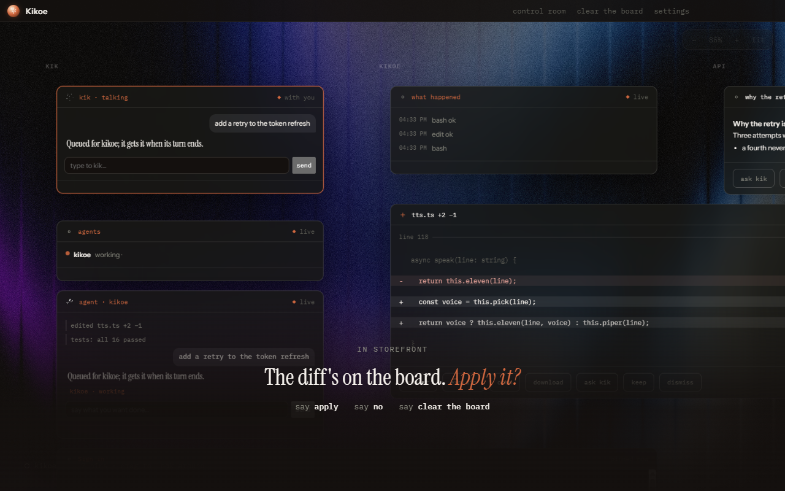
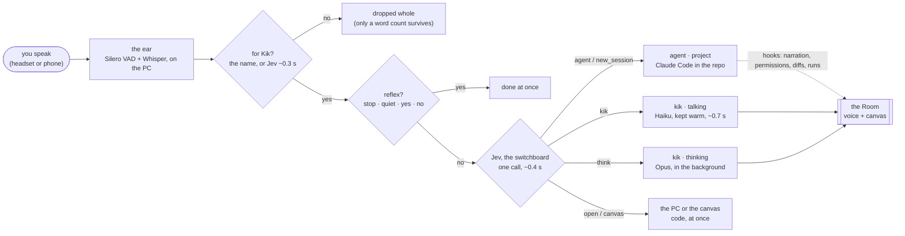
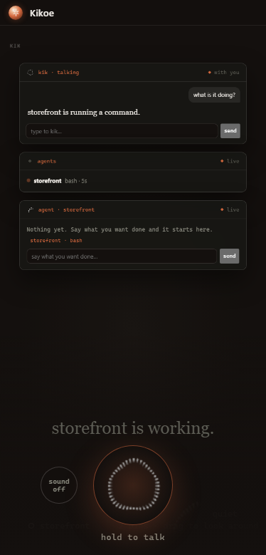

<p align="center">
  
</p>

<h1 align="center">Kikoe</h1>

<p align="center">
  <b>The room you run your coding agents from, by voice.</b><br />
  Talk to Kik. The agents do the work. The canvas shows what words can't carry.
</p>

<p align="center">
  
</p>

Kikoe (聞こえ, "audibility") is a desktop app for Windows (macOS and Linux
build in CI) that sits beside [Claude Code](https://claude.com/claude-code).
It has an ear, a voice, a mind and an infinite canvas:

- **It listens.** A headset mic and Whisper on your PC. Say "kik" (or don't:
  it works out whether a sentence was meant for it) and ask what the agent is
  doing, tell it what to build, or answer a permission with "yes".
- **It speaks.** One good line when a turn finishes, when something breaks, or
  when an agent needs a decision, and nothing through everything else.
- **It acts.** Starts a Claude Code session in the right project, hands it your
  words, opens the editor or a site, and puts pages, diagrams and checklists on
  the canvas.
- **It shows.** Every diff, test run and reply the agent makes lands on the
  canvas as a card you can act on, one board per project.

Everything runs through your own Claude subscription via Claude Code. No
terminal wrapper and no PTY: Claude Code's hooks go in, and speech and cards
come out.

## What you can say

| You say | What happens |
|---|---|
| "Kik, what's it doing?" | Answered from the live picture, in a sentence |
| "Open a new Claude session in storefront and tell it to do one, two, three, four" | A fresh Claude Code session starts in `storefront` with exactly that job |
| "Tell it to add a retry to the token refresh" | Straight to the agent if it's idle, queued for the end of its turn if not |
| "Yes" / "no" (while a permission is waiting) | The agent's permission prompt is answered; nothing else touches it |
| "Think this through: SQLite or a JSON file per project?" | Handed to a thinking session. Kik answers in a few sentences and puts the detail on the canvas |
| "Make me a release checklist" / "draw the retry flow" | A card on the canvas |
| "Open marine in VS Code" / "open github.com" / "a terminal in billiar" | Opened on the PC, from a fixed menu |
| "Open YouTube here" | A live web card on the canvas |
| "Switch to storefront" | The whole Room moves to that project's board |
| "Stop" / "quiet" / "stop the agent" | Reflexes: instant, never sent to a model |

## How it works



1. **Hearing.** The ear posts transcripts to the daemon. A sentence with the
   name is for Kik. One without it is judged by [Jev](https://docs.typesafe.ai),
   a System One model that returns a yes/no with a probability rather than
   text. What wasn't for Kik is dropped: not logged, not listed, not streamed.
2. **Deciding.** Jev answers four things in one call: what should happen
   (Kik, think, the agent, a new session, open, canvas, stop), which part of
   the sentence is the job (always a cut of your own words, never a
   paraphrase), what to open, and which project. Code then does it. When
   Jev is under 0.6 sure, or there's no key or network, the regex rules
   decide, as they did before Jev.
3. **Three sessions, one card each.** All three run through Claude Code on
   your subscription:

   | Card | What it is | Model | Speed |
   |---|---|---|---|
   | **kik · talking** | Kik's side of the conversation | Haiku, thinking off, one process kept open | first word in 0.5 to 1.7 s |
   | **kik · thinking** | questions that need real thought | Opus, extended thinking | ~25 s, while you keep talking |
   | **agent · ‹project›** | the coding agent doing the work | Claude Code in the project folder | as long as the work takes |

4. **Showing.** Claude Code's hooks bring back what the agent did: it's
   narrated, permissions are held open until you answer, and every edit,
   command and reply becomes a card with buttons ("again", "revert",
   "explain") that turn into instructions to the agent. Kikoe itself never
   writes to your repo.

The full walk-through, with every number measured, is
[docs/PIPELINE.md](docs/PIPELINE.md).

## On your phone



The same canvas, streamed to your phone. Hold the orb and talk, and the work
happens on the PC as usual. Turn on sound and you hear Kik's voice on the
phone as well as at the desk.

- Switch on **Settings → Phone**, open the link on your phone and trust the
  certificate once. The phone gets its own token: it can watch the canvas and
  talk or type to Kik, but it can't approve a tool call or press a card's
  buttons.
- **Away from home**: with Tailscale, Kikoe serves the phone on your tailnet
  with a real certificate, reachable only from your own devices.

And on the desk, the **island**: a pill at the top of the screen with Kik's
state and a ring for how much of each assistant's limit is used.


<br clear="right" />

## Install and run

You need Windows 10 or 11, Node 20+, pnpm 10, and
[Claude Code](https://claude.com/claude-code) installed and signed in.

```bash
git clone https://github.com/builtbywally/kikoe.git
cd kikoe
pnpm install
pnpm app            # build, then launch the desktop app from source
```

On first run, **Settings → Start here** installs the Claude Code hooks, picks
a voice (Piper is bundled; ElevenLabs if you have a key) and turns on
listening. Models (Whisper, Silero, Piper, Kokoro) download to
`~/.kikoe/models` on first use.

Optional keys go in plain files in `~/.kikoe/`. They're never printed or logged,
and Kikoe works without any of them:

| File | What it adds |
|---|---|
| `jev_key.txt` | Jev ([TypeSafe](https://docs.typesafe.ai)): knows when you're talking to Kik without the name, and routes sentences in ~0.4 s. Without it, rules decide. |
| `elevenlabs_key.txt` | The ElevenLabs voice; otherwise Piper, Kokoro or the system voice |
| `openrouter_key.txt` / Anthropic key in Settings | Only for the API-backed head; the default head uses Claude Code and needs no key |

### Build the installer

```bash
cd packages/app
pnpm exec electron-builder --config.directories.output=../../../kikoe-dist
../../../kikoe-dist/kikoe-0.1.0-win-x64.exe /S    # silent install to %LOCALAPPDATA%\Programs\kikoe
```

Build **outside the repo** (a file watcher on `out/` locks it) and **with
pnpm, never npx**: npx resolves dependencies as npm and silently drops the
ear's native modules. Afterwards, check that
`win-unpacked/resources/app/node_modules` lists `audify`,
`sherpa-onnx-node` and `sherpa-onnx-win-x64`.

## Developing

```bash
pnpm test           # vitest, 300+ tests; never touches ~/.claude or the OS voice
pnpm lint           # biome
pnpm typecheck
```

Every change goes through the same loop:

1. `pnpm test`, `pnpm lint`, `pnpm typecheck`.
2. A screenshot with the app stopped:
   `taskkill //IM kikoe.exe //F`, then from `packages/app`,
   `npx electron . --screenshot out.png`. It stages a board and writes
   `out.png`, `out-settings.png` and `out-island.png`.
3. One spoken line through the running app:
   `curl -s -K ~/.kikoe/speak.curlrc --data-binary "a line to say"`.
4. Commit: a title, a paragraph on why, then push.
5. Build the installer, install it silently, and check that `/state` shows
   the mic listening.

The images in this README come from `bash scripts/readme-images.sh`. It uses
a staged board and a throwaway home, so no real data gets in.

Only one daemon can own port 4570, so stop the installed app before running
from source. Useful while developing:

```bash
TOKEN=$(cat ~/.kikoe/daemon_token.txt)
curl -s -H "Authorization: Bearer $TOKEN" http://127.0.0.1:4570/state      # the whole picture
curl -s -X POST -H "Authorization: Bearer $TOKEN" -H "Content-Type: application/json" \
  -d '{"text":"make me a checklist for the release"}' http://127.0.0.1:4570/say  # type to Kik
tail -f ~/.kikoe/logs/daemon.log
```

### Layout

```
packages/core     pure logic, no I/O: events, narrator, arbiter (one mouth, many agents),
                  tracker, router (the name, reflexes), head (the rulebook), diagram → SVG
packages/daemon   the long-lived process: hooks, the TTS ladder, speaker, board, projects,
                  jev.ts (the switchboard), livebrain.ts / codebrain.ts (Kik's two sessions),
                  agents.ts (starting Claude Code), work.ts (cards from the agent's work),
                  walkie.ts + tailnet.ts (the phone), pc.ts (opening things), usage.ts (rings)
packages/app      Electron: main.ts (daemon in the main process, tray, windows),
                  mic.ts (the ear: audify → Silero VAD → Whisper), renderer/room (the Room,
                  the canvas, settings, the phone), renderer/island (the pill)
packages/cli      `kikoe speak`, `kikoe show`: push a line or a card from a script
evals/            narration, impulse and fleet fixtures: the acceptance contract for the voice
docs/             how it works and why (below)
```

### Docs

| | |
|---|---|
| [HANDOVER](docs/HANDOVER.md) | Start here: the state, the decisions, and the gotchas the code doesn't say |
| [PIPELINE](docs/PIPELINE.md) | From a sentence to something done, with every number measured |
| [SENTIENCE](docs/SENTIENCE.md) | The goal: Kik feels like someone in the room |
| [AUDIT](docs/AUDIT.md) | Every flow, its gaps, and the plan |
| [ROADMAP](docs/ROADMAP.md) | Milestones |
| [HEARING](docs/HEARING.md) | The researched plan for the ear: endpointing, recognition, addressee detection, echo |
| [VOICE](docs/VOICE.md) | The narrator's register: what is worth saying, and how |
| [EVAL-MODELS](docs/EVAL-MODELS.md) | Why the voice runs on Haiku and the designer on Sonnet |
| [OS](docs/OS.md) | Kikoe as the operating system of the PC: the concept |

## Principles

- **What wasn't said to Kik is dropped whole.** Only a word count survives.
- **Permissions are never skipped.** Answering them by voice is the product.
  The model never sits between a permission and its answer.
- **Hooks in, hooks out.** No PTY wrapper and nothing parsed from a terminal.
- **The rulebook is the floor.** With no key, no network and no model, Kik
  still hears, answers, narrates and starts agents. It just loses the
  personality.
- **Jev chooses; code acts.** No model writes a command that gets run.

## License

MIT.
